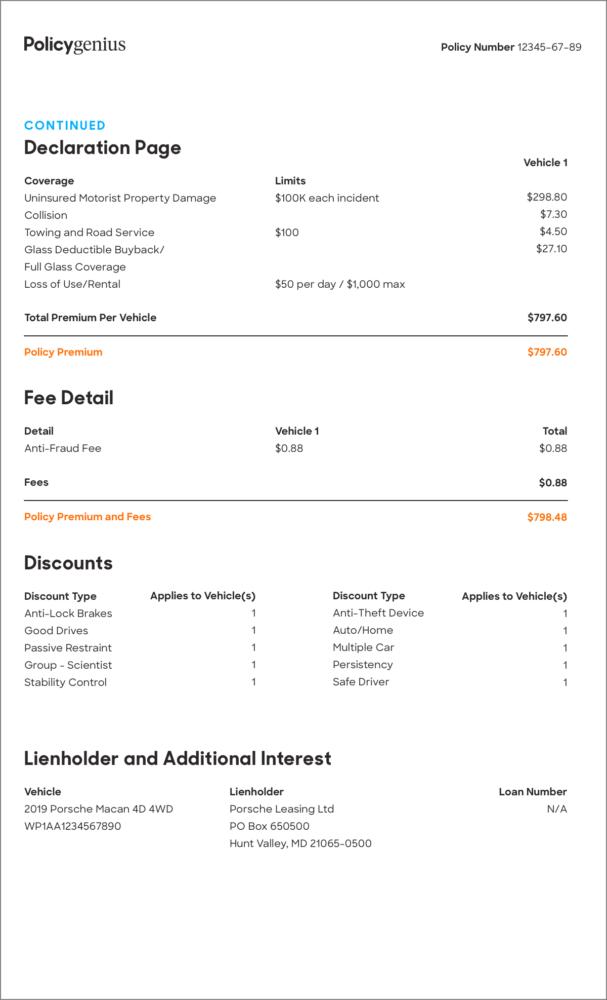

Text-extraction-invoices
=====================

The objective is to be able to extract the text from an invoice in english or in polish while maintaining its structure. 
The code also performs well for a poor quality invoice by using an upscaling model developed [here](https://github.com/openvinotoolkit/openvino_notebooks/tree/main/notebooks/202-vision-superresolution).

Installation
----

The easiest way to install is using the following command line : 
~~~ 
!python3 -m pip install --ignore-installed -r requirements.txt 
~~~

Usage
----

Three inputs must be given :

``file_path`` : the path of the invoice. The format must be readable by the Pillow library or a .pdf

``dir_result`` : the path of the directory to save the result wich is a .txt with the texts and their coordinates

``models_path`` : the path of the models folder

Then you can use the following command to extract the text from your invoice :

~~~ 
!python3 text_extraction.py --file_path=your/invoice/path --dir_result==directory/to/save/the/result --models_path==path/to/the/models/folder
~~~

Example
----

Let's work with the following invoice :

The output is as follows :

#### 36,259,60,121 : Policygenius
#### 868,1156,78,110 : Policy Number 12345-67-89
#### 44,212,232,264 : CONTINUED
#### 41,371,263,330 : Declaration Page
#### 1032,1126,306,336 : Vehicle 1
#### 43,152,343,376 : Coverage
#### 540,610,344,372 : Limits
#### 44,432,376,409 : Uninsured Motorist Property Damage
#### 540,756,376,406 : $100K each incident
#### 1038,1126,374,404 : $298.80
#### 43,137,410,440 : Collision
#### 1064,1126,408,438 : $7.30
#### 43,313,443,479 : Towing and Road Service
#### 540,596,444,474 : $100
#### 1064,1126,442,472 : $4.50
#### 44,330,478,510 : Glass Deductible Buyback/
#### 1056,1128,476,506 : $27.10
#### 44,252,512,542 : Full Glass Coverage
#### 44,244,548,576 : Loss of Use/Rental
#### 540,806,546,578 : $50 per day / $1,000 max
#### 44,316,612,642 : Total Premium Per Vehicle
#### 1038,1128,612,642 : $797.60
#### 44,208,682,712 : Policy Premium
#### 1038,1128,680,710 : $797.60
#### 41,231,763,807 : Fee Detail
#### 44,112,838,866 : Detail
#### 540,636,836,866 : Vehicle 1
#### 1070,1128,836,866 : Total
#### 46,204,872,900 : Anti-Fraud Fee
#### 540,606,870,900 : $0.88
#### 1062,1128,870,900 : $0.88
#### 44,100,938,964 : Fees
#### 1062,1128,938,968 : $0.88
#### 41,303,1001,1040 : Policy Premium and Fees
#### 1038,1128,1006,1036 : $798.48
#### 42,230,1086,1134 : Discounts
#### 44,196,1162,1194 : Discount Type
#### 294,510,1162,1194 : Applies to Vehicle(s)
#### 654,806,1162,1194 : Discount Type
#### 909,1127,1159,1195 : Applies to Vehicle(s)
#### 46,228,1198,1226 : Anti-Lock Brakes
#### 498,504,1202,1218 : 
#### 656,844,1196,1224 : Anti-Theft Device
#### 1114,1120,1204,1218 : 
#### 44,180,1230,1260 : Good Drives
#### 655,784,1228,1261 : Auto/Home
#### 1111,1123,1235,1255 : 
#### 44,228,1266,1294 : Passive Restraint
#### 495,509,1233,1287 : 
#### 654,784,1264,1296 : Multiple Car
#### 1111,1123,1269,1289 :
#### 43,228,1299,1329 : Group - Scientist
#### 495,509,1301,1321 : 
#### 652,783,1294,1331 : Persistency
#### 1111,1123,1303,1323 : 
#### 42,219,1329,1365 : Stability Control
#### 498,504,1336,1352 : 
#### 654,776,1332,1360 : Safe Driver
#### 1114,1120,1338,1352 : 
#### 40,664,1471,1522 : Lienholder and Additional Interest
#### 44,126,1548,1578 : Vehicle
#### 450,568,1548,1578 : Lienholder
#### 982,1128,1550,1578 : Loan Number
#### 44,348,1582,1612 : 2019 Porsche Macan 4D 4WD
#### 449,667,1581,1617 : Porsche Leasing Ltd
#### 1078,1126,1584,1612 : N/A
#### 46,244,1616,1646 : WP1AA1234567890
#### 450,618,1616,1646 : PO Box 650500
#### 450,740,1650,1682 : Hunt Valley, MD 21065-0500
