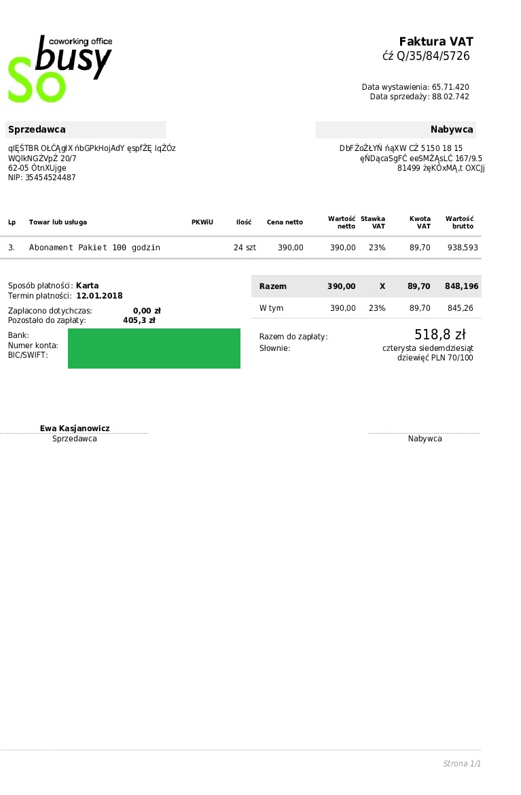

# Target extraction

The aim here is to use a OCR+NLP model to extract the wished text from an invoice. In this package, it is possible to train your own extraction features model with the same structure as the [LayoutLM](https://huggingface.co/microsoft/layoutlm-base-uncased) model. Disposing of invoice templates, you can generate your dataset with the following [repository](https://github.com/h2o64/faktur_generator). You can also use the code **target_text_extraction.py** to extract with your trained model the text from an invoice. The result is saved as a json file in the specified directory. In my case, the LayoutLM model has been pre-trained on a polish invoices dataset, using the repository quoted, based on 20 templates with 1 000 generated invoices per template (of course you can train your model on a smaller dataset). For more details, please refer to the following [tutorial](https://towardsdatascience.com/fine-tuning-transformer-model-for-invoice-recognition-1e55869336d4).

## Train your LayoutLM model

### Installation 

First you need to clone 2 gits and install several tools :

~~~
! git clone -b remove_torch_save https://github.com/NielsRogge/unilm.git
! cd unilm/layoutlm
! pip install unilm/layoutlm
~~~

and 

~~~
! git clone https://github.com/huggingface/transformers.git
! cd transformers
! pip install ./transformers
~~~

### Usage

Then you can start the training as below :

~~~
!python3 set_up_train.py --data_path=path/to/your/data/generated --model_path=path/to/save/the/LayoutLM/model/trained
~~~

Once done, you can use your model to extract your wished features. You can also check if your model didn't overfitted by testing it on your test data as follows:

~~~
!python3 eval.py --data_path=path/to/your/data/generated --model_path=path/to/your/saved/model
~~~

## Target extraction text

### Installation

First you will need to put the file **layoutlm_preprocess.py** in your downlaod packages : `` Python\Python38\Lib\site-packages `` . Then let's install with the command below :

~~~
!python3 -m pip install --ignore-installed -r requirements.txt 
~~~

### Usage & Example

Now the extraction of the wished text is a very simple task. Let's use the command line as follows :

~~~
!python3 eval.py --file_path=path/to/your/invoice --dir_result=path/to/the/repository/to/save/results --models_path=path/to/your/trained/LayoutLM/model
~~~

Please note that the input must necessarily be a pdf file. However, the input can contain several page. Let's test our OCR+NLP AI on the invoice generated below :

We get the following results in json output :

~~~
{
    "S-SELLE_ID": ["GIESTER", "OLCAGIX", "fibGPKHOAGY", "espfZE", "IqZ6z", "WQINGZVpZ", "6205", "Oin\u00a5Ujge", "NiP:", "35454524487", "Lo"], 
    "S-BUYER_ID": ["3.", "DbFZGZLYN", "fQXW", "CZ", "5150", "15", "eNDacaSqFC", "eesMZASLC", "81499", "26KOXMAL", "OXC)]"], 
    "S-QUANTITY_ID": ["24 stz"], 
    "S-PRICENETTO_ID": ["405,32", "848,196", "518,8"], 
    "S-INVOICE_ID": ["Faktura", "VAT", "Q/35/84/5726"], 
    "S-DATE_ID": ["Data", "wystawienia:", "65.71.420", "sprzedazy:", "88.02.742"] 
  }
 ~~~

### Web application

In the directory **demo web**, a code using **fastapi** is available. You just need to go in this directory and execute the following command :

~~~
uvicorn main:app
~~~

Pease specify in the file `` main.py `` the path to the localisation of your trained LayoutLM model in the variable `` mp `` .
